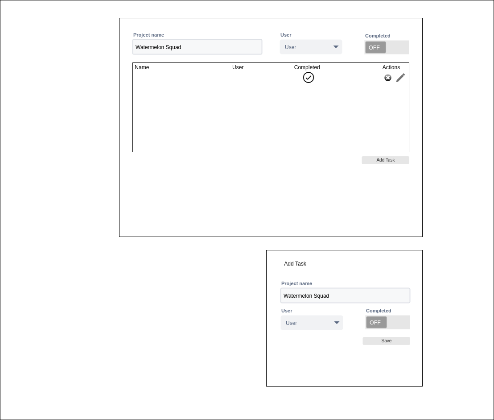

This project was bootstrapped with [Create React App](https://github.com/facebook/create-react-app).

## Steps setup to the App 
- npm install
- npm start 

## Required Packages 
some these will need to be installed and set up 
- [Material UI](https://material-ui.com/)
- [React Select](https://react-select.com/home)
- [Axios](https://github.com/axios/axios)
- Typescript

### A simple demonstration of React application
This is a demonstration how the code is structred and organsied.

API's Already Implemented
- GET api/todos
- GET api/todo/:id
- DELETE api/todo/:id/delete
- POST api/todo/create
- GET api/users
- GET api/user/id/todos

- List Tasks
- Filter tasks by name, user, is completed
- Add Task
- Edit Task
- Delete Task
- Global State (React Hooks and Context Providers)
### Mockups 

